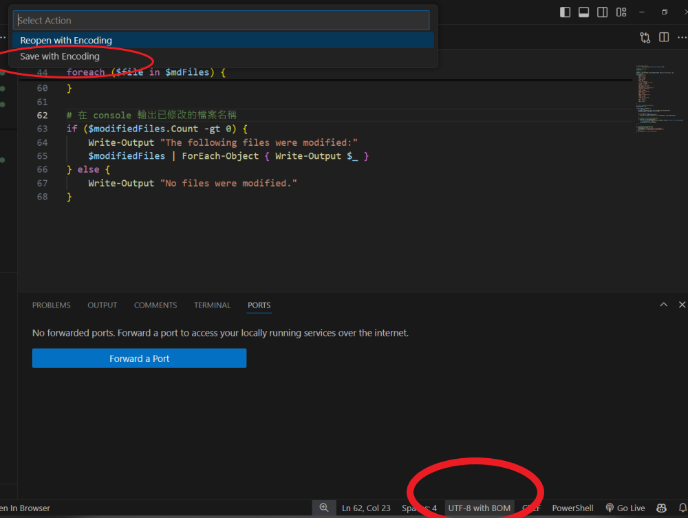

# What is this?

This is a Windows PowerShell script that can replace specific strings in text files. Simply modify the working folder and file extension to fit your needs.

It works like Ctrl+H in VSCode but supports multiple replacements. I used it to change `Chinese_Hans` to `Chinese_Hant`. It is very fast and helpful. You can also use it for other replacements. For text replacement, I highly recommend it.

## NOTICE
If Traditional Chinese is in your dictionary, make sure to save the file using ***"UTF-8 with BOM."*** In VSCode, you can change the encoding format in the lower right corner.

