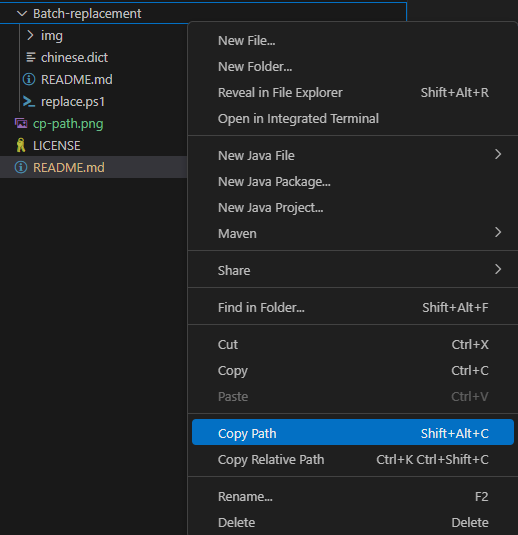

# shadow-command
⬆️ ⬆️ ⬇️ ⬇️ ⬅️ ➡️ ⬅️ ➡️ 🅱️ 🅰️

<div align="center">

### With automation's might, tasks become light, and progress takes flight.
<div align="right">
Einstein — hasn't said.
</div>
</div>

---- 
I will  updated some commands that I frequently use. You might find them helpful and useful.

Just place the script in the work folder and start using it.
```bash
cd {path/to/your/work/folder}
```

In VSCode you can right click and select "Copy Absolute Path" to get the archive path and then use it to change directories directly by cd command.


