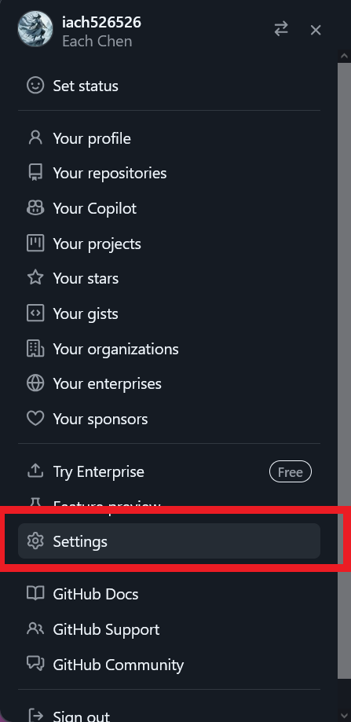
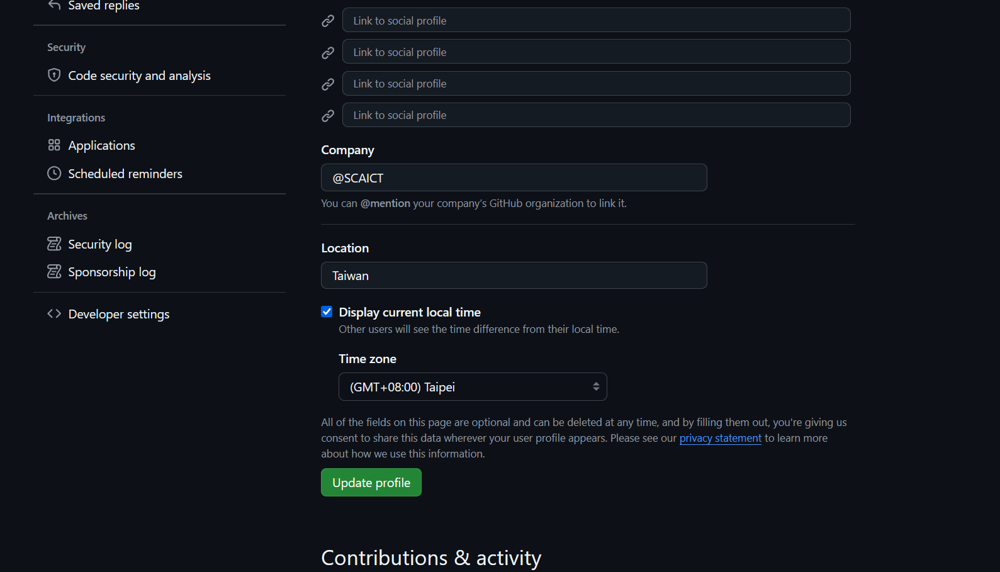
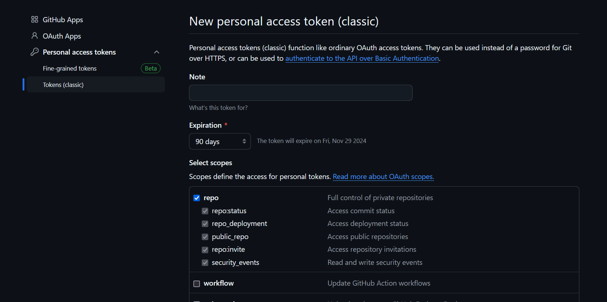

# Setup
這是 git 教學和常用指令第一篇
## 安裝 Git
確認你的作業系統，[點我下載 git](https://git-scm.com/downloads)
## 安裝文字編輯器
之後一定會用到的，你不可能只用記事本。對於 Mac 和 Windows ，我都推薦使用 [Visual studio code](https://code.visualstudio.com/)
## 註冊 GitHub 並設定 token
如果你沒有的話，請到 [GitHub](https://github.com/) 註冊

1. 在 GitHub 首頁，點擊右上角的頭像，然後選擇 **Settings**。

   

2. 在左側選單中，點擊 **Developer settings**。
   

3. 選擇 **Personal access tokens**，然後點擊 **Tokens (classic)**。

   

4.  **Generate new token**，至少確定權限 repo 有打勾，輸入你之後回來看還能認得的敘述(什麼時候開的、為了什麼做什麼用等等)，日期先設定 90 天，最後點擊 **Generate token**。確保將生成的 token 保存到安全的地方，因為這是你之後操作 Git 的憑證。

   
> 如果之後你把 token 弄丟了可以回到  GitHub Personal access tokens (classic) 頁面把這個 key 刪除。